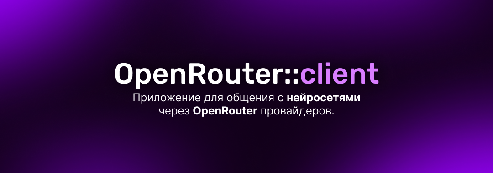
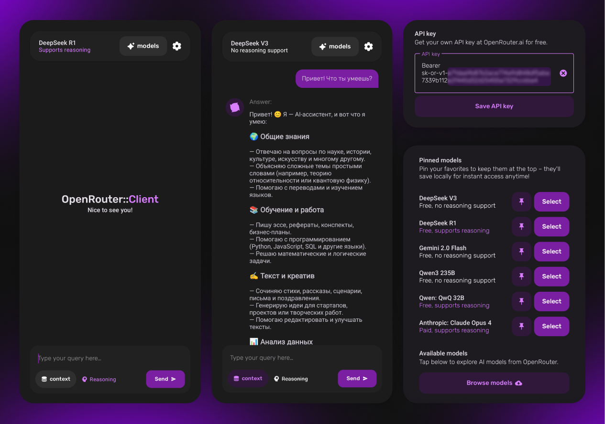
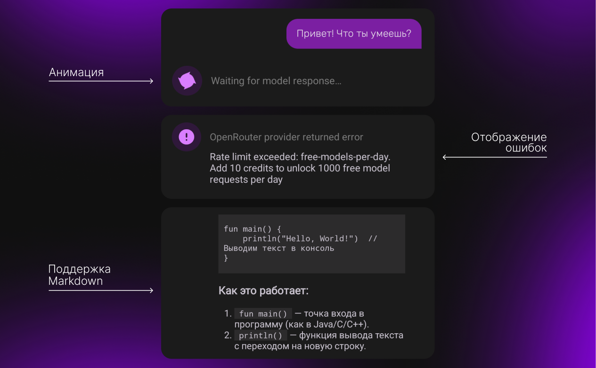
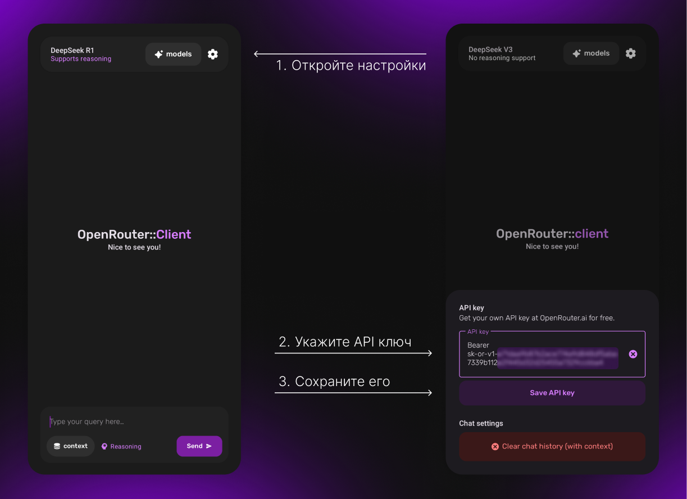

**OpenRouter::client** — Android-приложение для общения с нейросетями через сервис [OpenRouter.ai](https://openrouter.ai/). <br>Проект разработан в **учебных целях** для закрепления  навыков.

## Возможности 

- Отправка запросов в нейросеть через OpenRouter API
- Выбор и сохранение в избранное AI-моделей из каталога OpenRouter.
- Переключение режима контекста (использование истории чата в запросе)
- Сохранение истории сообщений в виде чата
- Использование кастомного API-ключа
- Сброс истории чата

## Скриншоты




## Планы по развитию проекта

Проект будет совершенствоваться по мере моего профессионального роста. В будущем планируются как точечные улучшения и исправления, так и внедрение современных подходов и технологий.

## Архитектура

Проект построен по принципам **Clean Architecture** и разделён на слои:

- **Presentation** (UI, Activity, Fragments, ViewModels)
- **Domain** (UseCases, Entities, Repository interfaces)
- **Data** (Room, Retrofit, Repositories, Mappers)
- **DI** (Component, Modules, Scope, Qualifiers)

Реализован MVVM-паттерн (ViewModel + Flow).
<br>Dependency Injection через Dagger2.

## Технологический стек

- **Kotlin**, **Android SDK**, **Coroutines**, **Flow**, **ViewBinding**
- **Room** (хранение истории чата и избранных AI-моделей)
- **Retrofit2** (сетевые запросы к OpenRouter API)
- **Dagger2** (внедрение зависимостей)
- **Markwon** (рендеринг markdown)

## Сборка и запуск

1. Склонируйте репозиторий:
```bash
  git clone git@github.com:Nu11Object/open-router-android-client.git
  cd open-router-android-client
```
2. Соберите проект и запустите приложение.
3. Добавьте свой OpenRouter API-ключ:
   - Перейдите на сайт [OpenRouter.ai](https://openrouter.ai/) и зарегистрируйтесь.
   - Создайте новый API-ключ в [настройках профиля](https://openrouter.ai/settings/keys).
   - Укажите его в настройках приложения:


