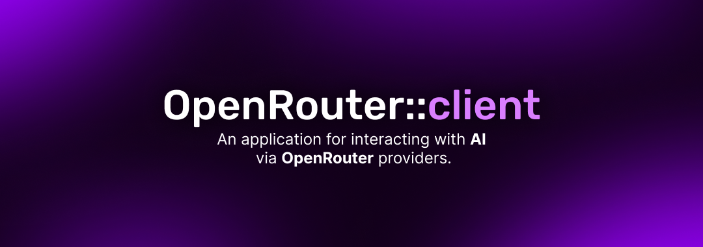
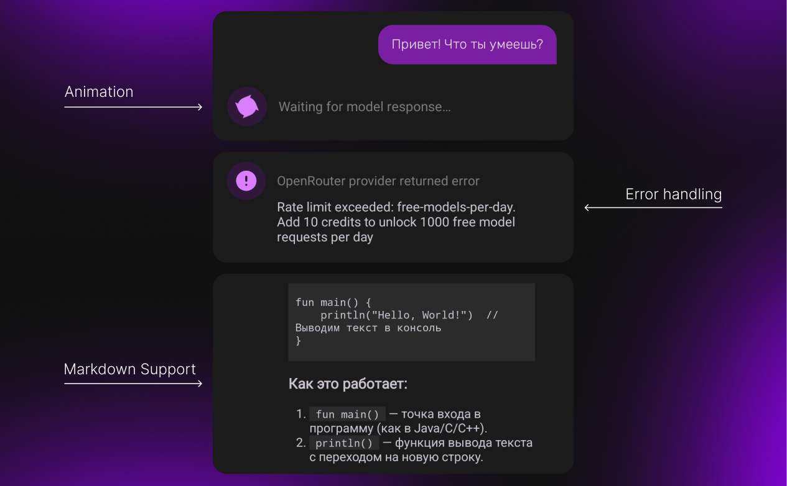

**English** | [Русский](README.ru.md)



**OpenRouter::client** — Android application for communicating with neural networks via the [OpenRouter.ai](https://openrouter.ai/) service. <br>The project was developed **for educational purposes** to strengthen skills.

## Features

* Sending requests to a neural network through the OpenRouter API
* Selecting and saving favorite AI models from the OpenRouter catalog
* Switching context mode (using chat history in the request)
* Saving message history as a chat
* Using a custom API key
* Clearing chat history

## Screenshots




## Architecture

The project is built according to the principles of **Clean Architecture** and divided into layers:

* **Presentation** (UI, Activity, Fragments, ViewModels)
* **Domain** (UseCases, Entities, Repository interfaces)
* **Data** (Room, Retrofit, Repositories, Mappers)
* **DI** (Component, Modules, Scope, Qualifiers)

The MVVM pattern is implemented (ViewModel + Flow).<br>
Dependency Injection is handled via Hilt.

## Tech Stack

* **Kotlin**, **Android SDK**, **Coroutines**, **Flow**, **ViewBinding**
* **Room** (storing chat history and favorite AI models)
* **Retrofit2** (network requests to the OpenRouter API)
* **Hilt** (dependency injection)
* **Markwon** (markdown rendering)

## Build and Run

1. Clone the repository:

```bash
  git clone git@github.com:Nu11Object/open-router-android-client.git
  cd open-router-android-client
```

2. Build the project and run the application.
3. Add your OpenRouter API key:

   * Go to [OpenRouter.ai](https://openrouter.ai/) and register.
   * Create a new API key in [profile settings](https://openrouter.ai/settings/keys).
   * Specify it in the application settings:


